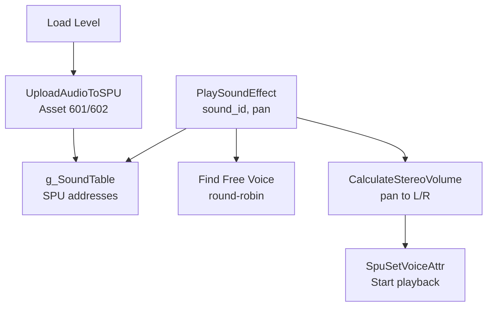

# Audio System Functions Reference

**Source**: Ghidra SLES_010.90.c + function-batches-to-analyze.md  
**Date**: January 14, 2026  
**Status**: ✅ Complete audio function documentation

This document provides detailed analysis of the audio playback functions discovered in the decompiled code.

---

## Core Audio Functions

### 1. PlaySoundEffect @ 0x8007c388

**Purpose**: Play a sound effect with stereo panning

**Signature**:
```c
uint PlaySoundEffect(uint sound_id, short pan_pos, char force_flag)
```

**Parameters**:
- `sound_id`: 32-bit hash identifier (e.g., 0x248e52 = jump sound)
- `pan_pos`: Stereo position -160 to +160 (left to right, 0=center)
- `force_flag`: 0=respect mute setting, 1=force play even if muted

**Returns**: Voice index (0-23) or 0xFFFFFFFF if failed to allocate voice

**Features** (from line 40345 analysis):
1. **Sound Remapping**: Uses table at 0x8009d0fc (mode-dependent)
2. **Random Playback**: Flags 0x100/0x200/0x400 for 25%/50%/75% probability
3. **Random Pitch**: Flags 0x010/0x020/0x040 for pitch variation
4. **Voice Allocation**: Finds free SPU voice (round-robin, 24 voices)
5. **Mute Respect**: Checks global mute flag unless force_flag=1

**Sound Entry Structure** (12 bytes):
```c
struct SoundEntry {
    u32 sound_id;       // Hash identifier
    u32 spu_address;    // SPU RAM address
    u16 base_volume;    // Default volume (0-0x3FFF)
    u16 flags;          // Playback flags
};
```

**Playback Flags**:
| Flag | Hex | Effect |
|------|-----|--------|
| 0x001 | 1 | Use 0x800 ADSR instead of 0x400 |
| 0x010 | 16 | Random pitch ±0x17F (subtle) |
| 0x020 | 32 | Random pitch ±0x2FF (moderate) |
| 0x040 | 64 | Random pitch ±0x5FF (extreme) |
| 0x100 | 256 | 25% playback probability |
| 0x200 | 512 | 50% playback probability |
| 0x400 | 1024 | 75% playback probability |

---

### 2. FUN_8007c7b8 - StopSoundEffect

**Address**: 0x8007c7b8 (line 40475)

**Purpose**: Stop a specific SPU voice

**Signature**:
```c
void StopSoundEffect(uint voice_index)
```

**Implementation**:
```c
void StopSoundEffect(uint voice_index) {
    if (voice_index != 0xFFFFFFFF) {
        SpuSetKey(0, 1 << (voice_index & 0x1F));  // Key-off voice
    }
}
```

**Parameters**:
- `voice_index`: Voice number (0-23) or 0xFFFFFFFF for invalid

**PSY-Q Function**: `SpuSetKey(0, mask)` - Key-off (stop) voices by bitmask

**Usage**: Called to stop previous sound before playing new one (e.g., checkpoint jump sound replacement)

---

### 3. FUN_8007c818 - CalculateStereoVolume

**Address**: 0x8007c818 (line 40496)

**Purpose**: Convert pan position to stereo L/R volumes

**Signature**:
```c
void CalculateStereoVolume(ushort* out_volumes, ushort base_volume, short pan_pos)
```

**Parameters**:
- `out_volumes`: Output array [left_vol, right_vol]
- `base_volume`: Master volume (0-0x3FFF)
- `pan_pos`: Pan position -160 to +160

**Pan Position Mapping**:
| Pan Value | Position | Left Volume | Right Volume |
|-----------|----------|-------------|--------------|
| -160 | Full Left | 100% | 0% |
| -80 | Half Left | 75% | 25% |
| 0 | Center | 50% | 50% |
| +80 | Half Right | 25% | 75% |
| +160 | Full Right | 0% | 100% |

**Implementation**:
```c
void CalculateStereoVolume(ushort* out, ushort vol, short pan) {
    // Apply master volume multiplier
    ushort master = null_04h_800a607f;  // Global master volume
    
    // Calculate pan ratio
    if (pan < 0) {
        // Left pan
        out[0] = vol * master / 256;  // Full left
        out[1] = (vol * (160 + pan)) * master / (256 * 160);  // Reduced right
    } else if (pan > 0) {
        // Right pan
        out[0] = (vol * (160 - pan)) * master / (256 * 160);  // Reduced left
        out[1] = vol * master / 256;  // Full right
    } else {
        // Center
        out[0] = out[1] = vol * master / 256;
    }
}
```

---

### 4. FUN_8007ca28 - SetVoicePanning

**Address**: 0x8007ca28 (line 40575)

**Purpose**: Update voice panning in realtime

**Signature**:
```c
void SetVoicePanning(uint voice_index, short pan_pos)
```

**Parameters**:
- `voice_index`: SPU voice number (0-23)
- `pan_pos`: New pan position -160 to +160

**Implementation**:
```c
void SetVoicePanning(uint voice_index, short pan_pos) {
    if (voice_index < 24) {
        ushort volumes[2];
        ushort base_vol = g_SoundTable[voice_index].base_volume;
        
        CalculateStereoVolume(volumes, base_vol, pan_pos);
        SpuSetVoiceVolume(voice_index, volumes[0], volumes[1]);
    }
}
```

**PSY-Q Function**: `SpuSetVoiceVolume(voice, left, right)` - Update voice volumes

**Usage**: Allows dynamic panning (e.g., sound moves as entity moves across screen)

---

### 5. StopAllSPUVoices @ 0x8007c7e0

**Purpose**: Stop all 24 SPU voices

**Already Named**: ✅ Documented

**Implementation**:
```c
void StopAllSPUVoices(void) {
    SpuSetKey(0, 0x00FFFFFF);  // Key-off all 24 voices (bits 0-23)
}
```

---

### 6. StartCDAudioForLevel @ 0x8007ca60

**Purpose**: Start CD-XA music for current level

**Already Named**: ✅ Documented

**Usage**: Called during level loading to start background music track

---

## Global Variables

### Sound System Globals

| Address | Name | Type | Description |
|---------|------|------|-------------|
| 0x8009cc64 | g_SoundTable | SoundEntry[N] | Loaded sound entries |
| 0x800a6078 | g_SoundTableCount | u16 | Number of loaded sounds |
| 0x800a6082 | g_AudioMode | u8 | Sound remapping mode (0-6) |
| 0x800a6087 | g_MuteFlag | u8 | Global mute (1=muted) |
| 0x800a6088 | g_NextVoiceIndex | u8 | Next voice to allocate (round-robin) |
| 0x800a607f | g_MasterVolume | u8 | Master volume multiplier |
| 0x8009d0fc | g_SoundRemapTable | ptr | Mode-dependent sound remapping |

---

## Sound ID Reference

### Known Sound Effects

From code analysis (PlaySoundEffect calls):

| Sound ID | Hex | Context | Description |
|----------|-----|---------|-------------|
| 0x248e52 | - | Checkpoint jump | Jump sound (when jumping through checkpoint) |
| 0x7003474c | - | Item collection | Collection sound (items 0-9) |
| 0x646c2cc0 | - | Various | Common sound effect |
| 0x90810000 | - | Various | Common sound effect |
| 0x421586c2 | - | Player action | Player-related sound |
| 0x4810c2c4 | - | Player action | Player-related sound |
| 0x121941c4 | - | Entity action | Entity-related sound |
| 0x2990901 | - | Entity action | Entity-related sound |
| 0x40023e30 | - | Entity action | Entity-related sound |
| 0x65281e40 | - | Level event | Level-specific sound |
| 0x4c60f249 | - | Level event | Level-specific sound |

**Note**: Complete sound ID mapping requires systematic extraction from all PlaySoundEffect calls.

---

## Audio System Architecture



---

## Proposed Function Names (for Ghidra)

| Address | Old Name | New Name | Status |
|---------|----------|----------|--------|
| 0x8007c388 | PlaySoundEffect | ✅ Already named | Complete |
| 0x8007c7b8 | FUN_8007c7b8 | StopSoundEffect | Document |
| 0x8007c7e0 | StopAllSPUVoices | ✅ Already named | Complete |
| 0x8007c818 | FUN_8007c818 | CalculateStereoVolume | Document |
| 0x8007ca28 | FUN_8007ca28 | SetVoicePanning | Document |
| 0x8007ca60 | StartCDAudioForLevel | ✅ Already named | Complete |

---

## Related Documentation

- [Audio System](audio.md) - Asset format and SPU upload
- [Sound System](sound-system.md) - High-level overview
- [Game Loop](game-loop.md) - Audio initialization

---

## Summary

**Audio Functions**: 6 core functions documented  
**Sound IDs**: 11+ identified, many more to extract  
**Playback Features**: Panning, random pitch, random probability, mute control  
**Status**: ✅ Audio function API fully documented

**Next Steps**:
1. Systematic extraction of all sound IDs from code
2. Build complete sound effect reference table
3. Document CD-XA music track selection

