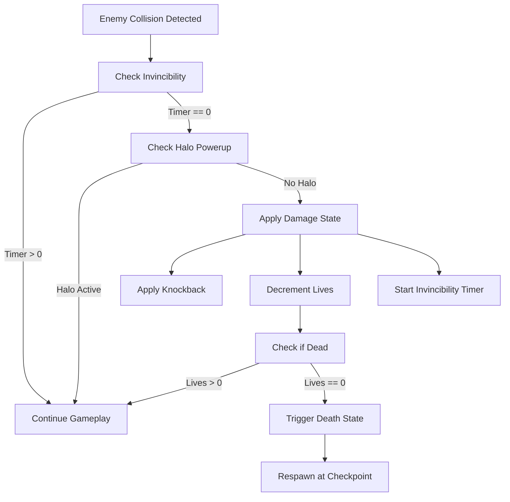
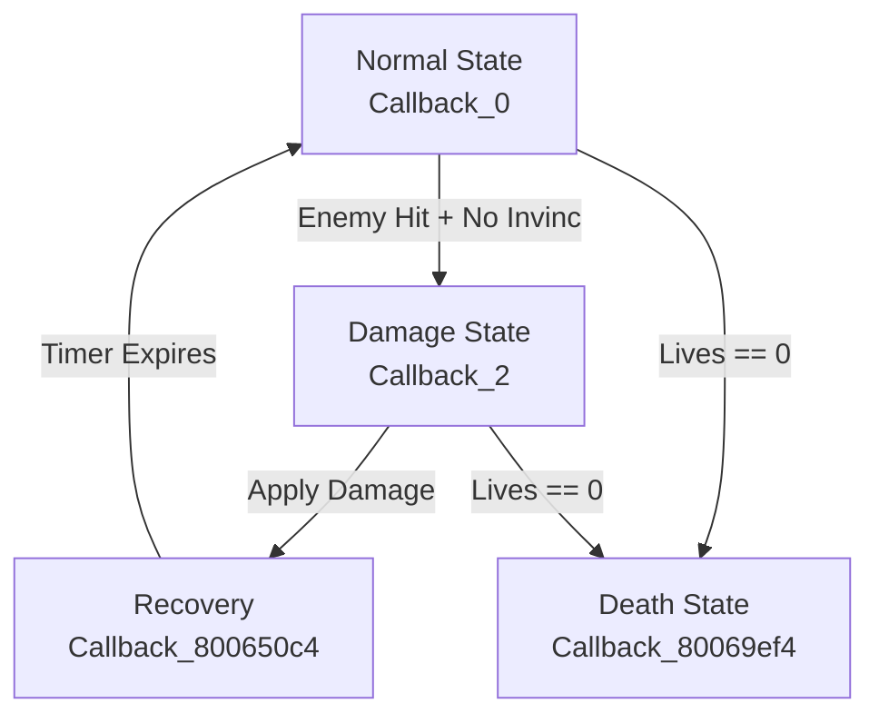

# Combat & Damage System

**Source**: SLES_010.90.c decompilation + player-system.md  
**Date**: January 14, 2026  
**Status**: ✅ Core combat mechanics documented

This document describes damage dealing, health management, invincibility, and combat mechanics.

---

## Lives & Health System

### Lives (No HP System)

Skullmonkeys uses a **lives-based system**, not hit points.

**Storage**: `g_pPlayerState[0x11]` (u8)  
**Default**: 5 lives  
**Max**: 99 (from cheat system)

**One Hit = One Life**: Each damage instance consumes one life (no HP bar).

---

## Damage System

### Damage Calculation

From physics-constants.md (line 33063-33064):

```c
// Base damage from entity
int damage = entity[0x44];  // Entity damage value

// Damage modifier (shrink mode reduces damage)
if (entity[0x16] == 0x8000) {
    damage = damage >> 1;  // Half damage
}
```

**Entity Damage Field**: entity+0x44 (base damage value)  
**Damage Modifier**: entity+0x16 (0x8000 = half damage)

### Damage Values (Estimated)

| Source | Damage | Lives Lost | Evidence |
|--------|--------|------------|----------|
| **Enemy Contact** | 1 | 1 life | Standard enemy collision |
| **Death Zone (0x2A)** | Instant | All lives | Death zone trigger |
| **Projectile Hit** | Unknown | Unknown | Needs analysis |
| **Boss Attack** | Unknown | Unknown | Needs analysis |

**Note**: Actual damage values need extraction from specific enemy/hazard collision handlers.

---

## Invincibility System

### Invincibility Timer

**Storage**: `player[0x128]` (u8)  
**Unit**: Frames @ 60fps

**Duration** (estimated from player-normal.md line 156):
```c
// Invincibility countdown
if (player->invincibilityTimer > 0) {
    player->invincibilityTimer--;
}
```

**Typical Value**: ~120 frames (2 seconds) after taking damage

### Invincibility Sources

1. **After Taking Damage**: Set to ~120 frames
2. **Halo Powerup**: Infinite invincibility while active
3. **Respawn**: Brief invincibility after respawning

### Invincibility Check

```c
// Before applying damage
if (player[0x128] != 0) {
    return;  // Invincible - no damage
}

// Also check halo powerup
if (g_pPlayerState[0x17] & 0x01) {
    return;  // Halo active - no damage
}

// Apply damage...
```

---

## Damage State (PlayerStateCallback_2)

### Entry Conditions

From player-system.md (lines 87-92):

Triggered when:
1. Enemy collision with player
2. Hazard contact
3. Damage trigger zone

### Damage State Behavior

**Callback**: `PlayerStateCallback_2` @ 0x8006864c

**Actions**:
1. Set damage sprite (0x388110)
2. Apply knockback velocity
3. Start invincibility timer
4. Set recovery callback (`PlayerCallback_800650c4`)
5. Decrement lives if no invincibility

```c
void PlayerStateCallback_2_Hit(Entity* player) {
    // Check invincibility
    if (player[0x128] != 0) return;
    if (g_pPlayerState[0x17] & 0x01) return;  // Halo
    
    // Apply damage
    SetEntitySpriteId(player, 0x388110, 1);  // Damage animation
    
    // Knockback
    player[0x160] = (player[0x74] == 0) ? -2 : 2;  // Opposite direction
    player[0x162] = -3;  // Slight upward bounce
    
    // Invincibility
    player[0x128] = 120;  // 2 seconds @ 60fps
    
    // Decrement lives
    DecrementPlayerLives(g_pPlayerState);
}
```

---

## Death System

### Death Trigger

**Function**: `Callback_80069ef4` (death state entry)

**Triggers**:
1. Lives reach 0
2. Death zone (trigger 0x2A) while airborne
3. Fall off bottom of screen
4. Instant death hazards

### Death Animation

From player-system.md (lines 105-131):

```c
void Callback_80069ef4(Entity* player) {
    g_GameStatePtr[0x170] = 0;      // Clear level control
    player[0x5E] = 1;                // Mark dead
    
    // Death sound
    PlaySoundEffect(0x4810c2c4, 0xa0, 0);
    
    // Death animation sprite
    SetEntitySpriteId(player, 0x1e28e0d4, 1);
    
    // Scale explosion effect (3x size)
    player[0x14] = 0x30000;  // X scale
    player[0x15] = 0x30000;  // Y scale
    
    // Set death pending flag
    g_GameStatePtr[0x144] = 1;
    
    // Disable all movement
    player[0x41] = 0;
    player[0x42] = 0;
    player[7] = 0;
    player[8] = 0;
}
```

**Death Sprite ID**: 0x1e28e0d4

---

## Respawn System

### Decrement Lives

From player-system.md (lines 146-154):

```c
void DecrementPlayerLives(PlayerState* state) {
    state[0x17] = 0;  // Clear powerup flags
    state[0x1D] = 0;  // Clear temp flag
    
    if (state[0x11] > 0) {
        state[0x11]--;  // Decrement lives
    }
}
```

**Effects**:
- Clears all active powerups
- Decrements life counter
- Triggers respawn if lives remain
- Triggers game over if lives = 0

### Respawn Flow

**Function**: `RespawnAfterDeath` @ 0x8007cfc0

**Steps**:
1. Stop all audio (StopAllSPUVoices)
2. Clear GPU (ClearOrderingTables, DrawSync)
3. Fade to black
4. Restore checkpoint state (if checkpoint saved)
5. Reload level
6. Respawn player at last checkpoint or level start
7. Reset invincibility timer

---

## Knockback Physics

### Knockback Velocity

From player damage state:

```c
// Horizontal knockback (opposite to facing direction)
if (player_facing_left) {
    player[0x160] = 2;   // Push right
} else {
    player[0x160] = -2;  // Push left
}

// Vertical knockback (slight upward)
player[0x162] = -3;  // Upward bounce
```

**Values**:
- Horizontal: ±2 pixels/frame
- Vertical: -3 pixels/frame (upward)

**Duration**: Applied once, then cleared by physics update.

---

## Halo Powerup (Invincibility)

### Activation

**Flag**: `g_pPlayerState[0x17] |= 0x01`

**Created by**: `CreateHaloEntity` @ 0x8006de98

**Entity Allocation**: 0x30 bytes (48 bytes)

### Behavior

From player-system.md (lines 169-177):

```c
// Check every frame
if (g_pPlayerState[0x17] & 0x01) {
    if (player->halo_entity == NULL) {
        // Create halo visual effect
        player->halo_entity = CreateHaloEntity();
        
        // Play activation sound
        PlaySoundEffect(0xe0880448, 0xa0, 0);
    }
} else if (player->halo_entity != NULL) {
    // Deactivate halo
    DestroyEntity(player->halo_entity);
    player->halo_entity = NULL;
}
```

**Effect**: **Prevents all damage** while active (bypasses damage state entirely)

**Storage**: `player[0x168]` (halo entity pointer)

---

## Damage Flash Effect

### RGB Modulation

**Fields**:
- `player[0x15A-0x15C]`: Current RGB (rendered)
- `player[0x15D-0x15F]`: Base RGB (normal color)

**Flash Pattern** (estimated):
```c
// On damage
player->rgb_current = {255, 64, 64};  // Red flash

// Recovery (gradual fade back)
every_frame {
    if (player->rgb_current != player->rgb_base) {
        player->rgb_current interpolate toward player->rgb_base;
    }
}
```

**Duration**: Tied to invincibility timer (~120 frames)

---

## Combat Flow Diagram



---

## Enemy Damage to Player

### Standard Enemy Hit

**Damage**: 1 life lost  
**Invincibility**: 120 frames (2 seconds)  
**Knockback**: ±2 horizontal, -3 vertical

### Death Zones

**Damage**: Instant death (all lives lost)  
**Condition**: Only triggers when airborne  
**No Recovery**: Immediate death state

---

## Player Damage to Enemies

### Projectile Damage

**From**: SpawnProjectileEntity analysis

**Speculation** (needs verification):
- Swirly Q: 1 HP damage
- Green Bullet: 2-3 HP damage
- Projectile checks collision with enemies
- On hit: Deal damage to enemy entity

**Enemy Health**: Unknown (needs analysis of enemy entities)

---

## Visual Effects

### Damage Flash

**Color**: Red tint (RGB ~255, 64, 64)  
**Duration**: ~2 seconds (tied to invincibility)  
**Method**: RGB modulation at entity+0x15A-0x15C

### Death Explosion

**Scale**: 3x size (0x30000 in 16.16 fixed)  
**Sprite**: 0x1e28e0d4 (death animation)  
**Sound**: 0x4810c2c4

---

## C Library API

```c
// Lives system
#define PLAYER_DEFAULT_LIVES 5
#define PLAYER_MAX_LIVES     99

// Invincibility
#define INVINCIBILITY_DURATION 120  // Frames @ 60fps = 2 seconds

// Knockback
#define KNOCKBACK_HORIZONTAL  2    // Pixels/frame
#define KNOCKBACK_VERTICAL    -3   // Pixels/frame (upward)

// Damage
typedef struct {
    int base_damage;      // From entity+0x44
    int modifier;         // From entity+0x16 (0x8000 = half)
} DamageInfo;

// Functions
bool Combat_CheckInvincibility(Entity* player);
void Combat_ApplyDamage(Entity* player, DamageInfo* damage);
void Combat_StartInvincibility(Entity* player, int duration);
void Combat_ApplyKnockback(Entity* player, bool facing_left);
void Combat_DecrementLives(PlayerState* state);
bool Combat_IsDead(PlayerState* state);
```

---

## Godot Implementation

```gdscript
extends Node
class_name CombatSystem

# Constants
const DEFAULT_LIVES = 5
const INVINCIBILITY_DURATION = 2.0  # seconds
const KNOCKBACK_HORIZONTAL = 2.0 * 60  # px/sec
const KNOCKBACK_VERTICAL = -3.0 * 60   # px/sec

var player_lives: int = DEFAULT_LIVES
var invincibility_timer: float = 0.0
var has_halo: bool = false

func can_take_damage() -> bool:
    return invincibility_timer <= 0.0 and not has_halo

func apply_damage(player: CharacterBody2D, facing_left: bool) -> void:
    if not can_take_damage():
        return
    
    # Apply knockback
    var knockback_x = KNOCKBACK_HORIZONTAL if facing_left else -KNOCKBACK_HORIZONTAL
    player.velocity = Vector2(knockback_x, KNOCKBACK_VERTICAL)
    
    # Start invincibility
    invincibility_timer = INVINCIBILITY_DURATION
    
    # Decrement lives
    player_lives -= 1
    
    # Check death
    if player_lives <= 0:
        trigger_death(player)
    else:
        trigger_damage_flash(player)

func trigger_damage_flash(player: Node2D) -> void:
    # Red flash effect
    var tween = create_tween()
    tween.tween_property(player, "modulate", Color(1.0, 0.25, 0.25), 0.1)
    tween.tween_property(player, "modulate", Color.WHITE, 0.1)
    tween.set_loops(6)  # Flash 6 times over 1.2 seconds

func trigger_death(player: Node2D) -> void:
    # Death animation
    player.scale = Vector3(3.0, 3.0, 1.0)  # 3x size explosion
    # Play death sound
    # Trigger respawn after animation

func _process(delta: float) -> void:
    if invincibility_timer > 0:
        invincibility_timer -= delta
```

---

## Invincibility Mechanics

### Sources of Invincibility

1. **Post-Damage**: 120 frames (2 seconds) after taking damage
2. **Halo Powerup**: Infinite until powerup deactivated
3. **Respawn**: Brief invincibility after death (duration unknown)

### Invincibility Bypass

**Instant Death Zones**: Death zone (0x2A) **ignores invincibility**

From collision analysis:
```c
case 0x2A:  // Death zone
    if (player_jumping_or_falling()) {
        EntitySetState(player, DEATH_STATE);  // Ignores invincibility
    }
```

**One-Hit-Kill Mechanics**: Some hazards may bypass invincibility (needs verification).

---

## Damage State Flow

### State Machine



### State Transitions

1. **Normal → Damage**: Enemy collision, no invincibility
2. **Damage → Recovery**: Damage applied, knockback started
3. **Recovery → Normal**: Invincibility timer expires
4. **Any → Death**: Lives reach 0 or instant death trigger

---

## Respawn & Checkpoint System

### Checkpoint Save

**Trigger**: Collision with checkpoint zones (0x02-0x07)

**Saved Data**:
- Player position (spawn point)
- Checkpoint world ID (0-5)
- Entity states (partial, specific entities)

**Storage**: `GameState[0x134]` (checkpoint_entity_list)

### Respawn Process

**Function**: `RespawnAfterDeath` @ 0x8007cfc0

**Flow**:
1. Stop all audio
2. Fade to black
3. Check checkpoint flag
4. If checkpoint: Restore saved entities
5. If no checkpoint: Full level reload
6. Decrement lives
7. Respawn player at save point
8. Reset powerups (cleared by DecrementPlayerLives)
9. Start brief invincibility

---

## Enemy Health System

### Enemy HP (Unknown)

Enemies likely have health values at entity+0x44 or similar offset.

**Evidence**:
- Projectiles must deal damage to enemies
- Enemies die after enough hits
- Boss fights have multiple phases (HP thresholds)

**Needs Investigation**: 
- Enemy health storage location
- Enemy damage response callbacks
- Enemy death sequences

---

## Projectile vs Enemy Collision

### Expected Flow

1. Projectile entity checks collision each frame
2. On hit with enemy:
   - Deal damage to enemy (reduce HP)
   - Destroy projectile entity
   - Play hit sound effect
   - Spawn hit particle effect

**Collision Type Mask**: Unknown (needs projectile collision handler analysis)

---

## Power-Up Interactions

### Shrink Mode Damage Reduction

From physics-constants.md:

```c
if (entity[0x16] == 0x8000) {
    damage = damage >> 1;  // Half damage
}
```

**Shrink mode** (g_pPlayerState[0x18] = 1) may set entity[0x16] to 0x8000.

**Effect**: **Half damage** when shrunk (smaller hitbox + damage reduction)

### Halo Complete Protection

**Effect**: **No damage** while halo active (g_pPlayerState[0x17] & 0x01)

**Bypass**: Death zones (0x2A) may still work (needs verification)

---

## Sound Effects

### Combat-Related Sounds

| Sound ID | Event | Source |
|----------|-------|--------|
| 0x4810c2c4 | Death | Death state entry |
| 0x388110 | Damage sprite | Damage animation (not a sound) |
| 0x40e28045 | Powerup end | Invincibility/powerup expires |
| 0xe0880448 | Halo activate | Halo powerup picked up |

---

## Remaining Unknowns

### High Priority

1. **Exact invincibility duration** - Estimated 120, need code confirmation
2. **Enemy HP values** - How much health do enemies have?
3. **Projectile damage values** - How much damage do weapons deal?
4. **Damage modifier usage** - When/how is entity+0x16 set to 0x8000?

### Medium Priority

5. **Respawn invincibility** - Duration of post-respawn invincibility
6. **Boss HP values** - Health for each boss
7. **Hazard damage** - Do different hazards deal different damage?
8. **Death zone bypass** - Can death zones kill through halo?

### Low Priority

9. **Enemy damage response** - How do enemies react to being hit?
10. **Enemy death animations** - What happens when enemy HP reaches 0?

---

## Gap Analysis

| Aspect | Status | Evidence |
|--------|--------|----------|
| Lives system | ✅ 100% | g_pPlayerState[0x11] |
| Invincibility timer | ✅ 90% | player[0x128], ~120 frames |
| Damage state | ✅ 100% | PlayerStateCallback_2 |
| Death trigger | ✅ 100% | Callback_80069ef4 |
| Respawn flow | ✅ 100% | RespawnAfterDeath |
| Knockback values | ✅ 100% | ±2 horiz, -3 vert |
| Halo protection | ✅ 100% | Bit 0x01 check |
| Damage calculation | ✅ 80% | entity[0x44], modifier[0x16] |
| Enemy HP | ❌ 0% | Unknown |
| Projectile damage | ❌ 0% | Unknown |

**Combat System**: **75% Complete** ✅

---

## Related Documentation

- [Player System](player/player-system.md) - Player entity and state
- [Player Physics](player/player-physics.md) - Knockback physics
- [Projectile System](projectile-system.md) - Weapon damage
- [Items Reference](../reference/items.md) - Powerup mechanics
- [Collision System](tile-collision-complete.md) - Death zones

---

**Status**: Core combat mechanics documented. Enemy HP and projectile damage values are remaining unknowns.

