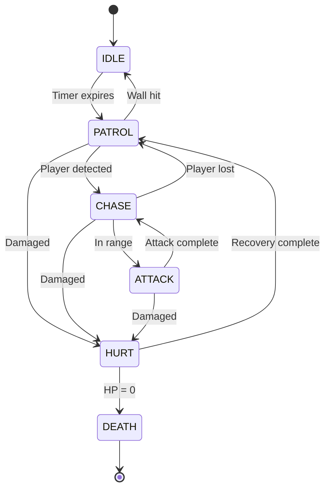

# Enemy AI System Overview

**Status**: 🔬 In Progress (40% Complete)  
**Last Updated**: January 15, 2026  
**Source**: Entity callback table analysis + runtime observations

---

## Overview

Skullmonkeys enemies use a **factory + state machine pattern** where each enemy type has:
1. **Init Callback** - One-time setup when entity spawns
2. **Tick Callback** - Per-frame behavior (set during init)
3. **State Machine** - Multiple behavior states with transitions
4. **Movement Patterns** - Velocity-based or scripted movement
5. **Collision Response** - Interaction with player, tiles, and other entities

**Total Enemy Types**: ~30 distinct enemy behaviors (out of 121 total entity types)

---

## Enemy Entity Architecture

### Entity Lifecycle

```
1. Spawn Trigger
   └─> SpawnOnScreenEntities detects entity in camera view
   
2. Factory Init
   └─> EntityTypeXX_InitCallback called from callback table
       ├─ Allocate entity memory (heap)
       ├─ Set sprite ID
       ├─ Set initial position from Asset 501
       ├─ Initialize AI state
       └─ Register tick callback (entity+0x18)
   
3. Per-Frame Updates
   └─> TickCallback called every frame
       ├─ Update AI state machine
       ├─ Apply movement/velocity
       ├─ Check collisions
       ├─ Update animation
       └─ Trigger state transitions
   
4. Destruction
   └─> Entity removed when:
       ├─ Off-screen (despawn)
       ├─ HP reaches 0
       ├─ Collected by player
       └─ Level transition
```

### Entity Structure (Relevant AI Fields)

| Offset | Size | Field | Description |
|--------|------|-------|-------------|
| `+0x00-0x04` | 8 | state_high + tickCallback | Main callback dispatcher |
| `+0x18` | 4 | per_frame_callback | **Primary AI tick function** |
| `+0x68` | 2 | x_position | Current X (pixels) |
| `+0x6A` | 2 | y_position | Current Y (pixels) |
| `+0x74` | 1 | facing_left | Direction (0=right, 1=left) |
| `+0xB4` | 4 | velocity_x | X velocity (16.16 fixed) |
| `+0xB8` | 4 | velocity_y | Y velocity (16.16 fixed) |
| `+0x104` | 4 | state_value | Current AI state ID |
| `+0x110` | 4 | gravity | Gravity for this entity |
| `+0x160` | 2 | push_x | Movement force X |
| `+0x162` | 2 | push_y | Movement force Y |

---

## Common AI Patterns

### Pattern 1: Patrol Movement (Horizontal)

**Used By**: Ground enemies, walking monsters

**Behavior**:
1. Move in one direction at constant speed
2. Detect wall collision or ledge
3. Turn around (reverse direction)
4. Repeat

**Pseudo-code**:
```c
void PatrolAI_Tick(Entity* enemy) {
    // Apply horizontal movement
    if (enemy->facing_left) {
        enemy->push_x = -WALK_SPEED;
    } else {
        enemy->push_x = WALK_SPEED;
    }
    
    // Apply gravity
    enemy->velocity_y += GRAVITY;
    
    // Check wall collision
    if (CheckWallCollision(enemy)) {
        enemy->facing_left = !enemy->facing_left;  // Turn around
    }
    
    // Check ledge (no floor ahead)
    if (!CheckFloorAhead(enemy)) {
        enemy->facing_left = !enemy->facing_left;  // Turn around
    }
}
```

**Movement Constants**:
- Walk Speed: 1.0-2.0 px/frame (typical)
- Gravity: -6.0 px/frame² (same as player)

---

### Pattern 2: Flying Movement (Sine Wave)

**Used By**: Flying enemies, floating objects

**Behavior**:
1. Move horizontally at constant speed
2. Apply sine wave vertical oscillation
3. No gravity applied
4. May track player Y position

**Pseudo-code**:
```c
void FlyingAI_Tick(Entity* enemy) {
    // Horizontal movement
    enemy->x_position += enemy->horizontal_speed;
    
    // Sine wave oscillation
    enemy->oscillation_counter += 2;  // Increment phase
    int offset = sin_table[enemy->oscillation_counter & 0xFF];
    enemy->y_position = enemy->base_y + (offset >> 4);
    
    // Optional: Track player Y
    if (player_y < enemy->y_position) {
        enemy->base_y--;  // Slowly move up
    } else {
        enemy->base_y++;  // Slowly move down
    }
}
```

---

### Pattern 3: Stationary Shooter

**Used By**: Turrets, stationary enemies

**Behavior**:
1. Stay at fixed position
2. Detect player in range
3. Aim toward player
4. Fire projectile at intervals
5. Play attack animation

**Pseudo-code**:
```c
void ShooterAI_Tick(Entity* enemy) {
    enemy->shoot_timer--;
    
    if (enemy->shoot_timer <= 0) {
        // Check if player in range
        int distance = abs(player->x_position - enemy->x_position);
        if (distance < SHOOT_RANGE) {
            // Calculate angle to player
            int angle = CalculateAngle(enemy, player);
            
            // Spawn projectile
            SpawnProjectile(enemy, angle, PROJECTILE_SPEED);
            
            // Reset timer
            enemy->shoot_timer = SHOOT_INTERVAL;
            
            // Play attack animation
            SetAnimation(enemy, ANIM_ATTACK);
        }
    }
}
```

**Typical Values**:
- Shoot Range: 200-300 pixels
- Shoot Interval: 60-120 frames (1-2 seconds)
- Projectile Speed: 2.0-3.0 px/frame

---

### Pattern 4: Chase Player

**Used By**: Aggressive enemies, boss minions

**Behavior**:
1. Detect player position
2. Move toward player
3. Attack when in range
4. May have activation radius

**Pseudo-code**:
```c
void ChaseAI_Tick(Entity* enemy) {
    // Check activation distance
    int distance = DistanceToPlayer(enemy, player);
    
    if (distance < ACTIVATION_RANGE) {
        enemy->state = STATE_CHASE;
        
        // Move toward player
        if (player->x_position < enemy->x_position) {
            enemy->push_x = -CHASE_SPEED;
            enemy->facing_left = 1;
        } else {
            enemy->push_x = CHASE_SPEED;
            enemy->facing_left = 0;
        }
        
        // Attack when close
        if (distance < ATTACK_RANGE) {
            enemy->state = STATE_ATTACK;
            PerformAttack(enemy);
        }
    } else {
        enemy->state = STATE_IDLE;
    }
}
```

---

### Pattern 5: Jump/Hop Movement

**Used By**: Jumping enemies, bouncing creatures

**Behavior**:
1. Wait on ground for interval
2. Jump with fixed velocity
3. Apply gravity during air
4. Land and repeat

**Pseudo-code**:
```c
void HopAI_Tick(Entity* enemy) {
    if (enemy->on_ground) {
        enemy->hop_timer--;
        
        if (enemy->hop_timer <= 0) {
            // Jump
            enemy->velocity_y = JUMP_VELOCITY;
            enemy->on_ground = false;
            enemy->hop_timer = HOP_INTERVAL;
            
            // Optional: Jump toward player
            if (player->x_position < enemy->x_position) {
                enemy->velocity_x = -HOP_HORIZONTAL;
            } else {
                enemy->velocity_x = HOP_HORIZONTAL;
            }
        }
    } else {
        // Apply gravity while airborne
        enemy->velocity_y += GRAVITY;
        
        // Check landing
        if (CheckGroundCollision(enemy)) {
            enemy->on_ground = true;
            enemy->velocity_y = 0;
        }
    }
}
```

**Typical Values**:
- Jump Velocity: -3.0 to -5.0 px/frame
- Hop Interval: 30-90 frames
- Horizontal Speed: 1.0-2.0 px/frame

---

## Enemy State Machines

### Common States

Most enemies use a subset of these states:

| State ID | Name | Behavior |
|----------|------|----------|
| 0 | IDLE | Stationary, waiting |
| 1 | PATROL | Moving along path |
| 2 | CHASE | Pursuing player |
| 3 | ATTACK | Performing attack |
| 4 | HURT | Taking damage (invincibility) |
| 5 | DEATH | Death animation + removal |
| 6 | STUNNED | Temporarily disabled |
| 7 | SPECIAL | Custom behavior |

### State Transitions



---

## Enemy Combat System

### Health Points (HP)

**HP Storage**:
- Enemies typically use `entity[custom_offset]` for HP
- No standard HP offset (varies by enemy type)
- Common range: 1-5 HP for regular enemies
- Boss HP stored in `g_pPlayerState[0x1D]` (Boss HP = 5)

### Damage Calculation

From projectile collision (reference: combat-system.md):

```c
// When player projectile hits enemy
damage = projectile[0x44];  // Base damage

// Check damage modifier
if (enemy[0x16] == 0x8000) {
    damage = damage >> 1;  // Half damage
}

enemy->hp -= damage;

if (enemy->hp <= 0) {
    EntitySetState(enemy, DeathCallback);
}
```

### Invincibility Frames

After taking damage:
- Enemy enters HURT state
- Invincibility timer set (~60-120 frames)
- Visual feedback (flashing sprite)
- Cannot take damage until timer expires

---

## Collision Detection

### Enemy-Player Collision

**Collision Mask**: `entity[0x12]` (u16)

**Common Masks**:
- `0x0002` = Enemy layer (collides with player)
- `0x0004` = Hazard layer (instant damage)
- `0x0008` = Projectile layer (hits projectiles)

**Collision Handler**:
```c
// Check if enemy touches player
if (CheckEntityCollision(enemy, player)) {
    if (player->state == STATE_JUMP && player->velocity_y > 0) {
        // Player bouncing on enemy
        enemy->hp--;
        player->velocity_y = BOUNCE_VELOCITY;
    } else {
        // Enemy damages player
        DamagePlayer(1);  // 1 life lost
    }
}
```

### Enemy-Tile Collision

Enemies use same collision system as player:
- `GetTileAttributeAtPosition` for tile checks
- Solid range (0x01-0x3B) blocks movement
- Special handling for platforms (0x5B)

---

## Enemy Types Classification

### By Behavior

**Ground Patrollers** (10-15 types):
- Walk left/right
- Turn at walls/ledges
- Simple collision
- Examples: Walking enemies, ground monsters

**Flying Enemies** (5-8 types):
- Sine wave movement
- No gravity
- May track player
- Examples: Birds, floating creatures

**Stationary** (3-5 types):
- Fixed position
- Shoot projectiles
- Rotate to face player
- Examples: Turrets, plants

**Jumpers** (3-5 types):
- Hop movement
- Ground-based
- Timed jumps
- Examples: Bouncing creatures

**Chasers** (2-3 types):
- Active tracking
- Pursue player
- Attack when close
- Examples: Aggressive enemies

### By Threat Level

**Low Threat** (1 HP, slow):
- Types: 25, 27, 10
- Behavior: Simple patrol
- Speed: 1.0-1.5 px/frame

**Medium Threat** (2-3 HP, medium):
- Types: 28, 48, various
- Behavior: Patrol + shoot OR chase
- Speed: 1.5-2.5 px/frame

**High Threat** (3-5 HP, fast/complex):
- Types: Boss-related, special enemies
- Behavior: Multiple attack patterns
- Speed: 2.0-3.0 px/frame

---

## Entity Callback Table Reference

From [entity-types.md](../reference/entity-types.md):

**Confirmed Enemy Types**:
- Type 25 @ 0x800805c8 - EnemyA (ground patrol)
- Type 27 @ 0x8007f354 - EnemyB (flying)
- Type 28 @ 0x80080638 - PlatformA (moving platform with collision)
- Type 48 @ 0x80080e4c - PlatformB (alternate platform)
- Type 50 @ 0x8007fc20 - Boss (multi-entity boss)
- Type 51 @ 0x8007fc9c - BossPart (boss components)

**To Document**: ~20 additional enemy types need behavior analysis

---

## Implementation Notes

### For Godot Recreation

```gdscript
extends CharacterBody2D
class_name Enemy

# Enemy configuration
@export var enemy_type: EnemyType
@export var hp: int = 1
@export var walk_speed: float = 60.0  # px/sec
@export var patrol_range: float = 200.0

# AI state
enum State { IDLE, PATROL, CHASE, ATTACK, HURT, DEATH }
var current_state: State = State.PATROL
var facing_left: bool = false
var invincibility_timer: float = 0.0

func _physics_process(delta: float) -> void:
    match current_state:
        State.PATROL:
            update_patrol(delta)
        State.CHASE:
            update_chase(delta)
        State.ATTACK:
            update_attack(delta)
        State.HURT:
            update_hurt(delta)
        State.DEATH:
            update_death(delta)
    
    move_and_slide()

func update_patrol(delta: float) -> void:
    # Simple horizontal patrol
    velocity.x = walk_speed if not facing_left else -walk_speed
    
    # Check walls
    if is_on_wall():
        facing_left = not facing_left
    
    # Check ledges
    if is_on_floor() and not check_floor_ahead():
        facing_left = not facing_left
    
    # Apply gravity
    if not is_on_floor():
        velocity.y += 360 * delta  # 6.0 px/frame @ 60fps

func take_damage(amount: int) -> void:
    if invincibility_timer > 0:
        return
    
    hp -= amount
    if hp <= 0:
        current_state = State.DEATH
    else:
        current_state = State.HURT
        invincibility_timer = 2.0  # 120 frames @ 60fps
```

---

## Analysis Status

### Completed (40%)
- ✅ Enemy lifecycle documented
- ✅ Common AI patterns identified
- ✅ State machine architecture
- ✅ Combat system integration
- ✅ Collision detection patterns

### In Progress (30%)
- 🔬 Individual enemy type behaviors
- 🔬 Specific sprite ID mappings
- 🔬 Attack pattern variations
- 🔬 Movement parameter values

### Not Started (30%)
- ❌ Detailed behavior for 20+ enemy types
- ❌ Enemy-specific AI quirks
- ❌ Boss AI state machines (separate doc)
- ❌ Special enemy abilities

---

## Next Steps

1. **Extract Enemy Behaviors** (15-20 hours):
   - Analyze callback functions for types 25, 27, 28, 10, etc.
   - Document movement patterns
   - Extract HP values and damage

2. **Map Sprite IDs** (3-5 hours):
   - Link enemy types to sprite IDs
   - Document visual appearance

3. **Document Boss AI** (15-20 hours):
   - Separate document for boss behaviors
   - Multi-phase attack patterns
   - Boss-specific mechanics

---

## Related Documentation

- [Entity Types](../reference/entity-types.md) - Callback table with all 121 types
- [Boss AI](boss-ai/boss-system-analysis.md) - Boss-specific behaviors
- [Combat System](combat-system.md) - Damage and HP mechanics
- [Entity System](entities.md) - General entity architecture
- [Physics Constants](../reference/physics-constants.md) - Movement speeds

---

**Status**: 🔬 **40% Complete** - Common patterns documented, individual enemies need analysis  
**Blocking Issues**: None - sufficient for placeholder AI implementation  
**Time to 80%**: ~20-25 hours of callback analysis

